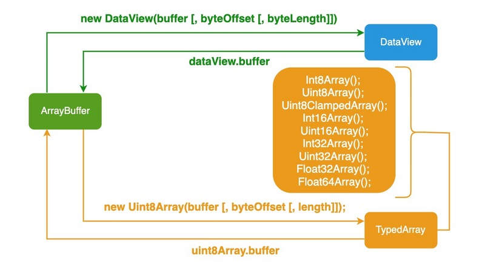

# 前端二进制的总结

在这里总结前端图片的处理和前端二进制相关的知识点


## 1、TypeArray

描述了一个底层的二进制数据缓冲区
int8Array (-128~127)
unint8Array (0~255)
Int16Array (-32768 32767)
Unint16Array (65535)

 ```javascript
let buffer = new ArrayBuffer(8)
console.log(buffer.byteLength)
const int8Array = new Int8Array(buffer)
console.log(int8Array.length)
console.log(int8Array.buffer === buffer)
let int16Array = new Int16Array(buffer)
console.log()
 ```

## 2、DataView

使用 new 调用 DataView 构造函数后，会返回一个表示指定数据缓存区的新 DataView 对象

可以读取多种数据类型的

 ```javascript
let buffer = new ArrayBuffer(2)
console.log(buffer.byteLength)
let dataView = new DataView(buffer)
dataView.setInt8(0,1)
dataView.setInt8(1,2)
console.log(dataView.getInt8(0)) //1
console.log(dataView.getInt8(1)) //2
console.log(dataView.buffer === buffer)
// DataView 和 TypeArray 都内部引用了buffer
 ```

### 2.1、DataView 方法

DataView 对象提供了 getInt8()、getUint8()、setInt8() 和 setUint8() 等方法来操作数据

```js
const buffer = new ArrayBuffer(16);

// Create a couple of views
const view1 = new DataView(buffer);
const view2 = new DataView(buffer, 12, 4); //from byte 12 for the next 4 bytes
view1.setInt8(12, 42); // put 42 in slot 12

console.log(view2.getInt8(0)); // expected output: 42
```

## 3、blob

表示二进制类型的大对象,用于操作二进制文件

不可变的类文件对象

```javascript
let debug = {name:'helloworld'}
let str = JSON.stringify(debug)
console.log(str)
let blob = new Blob([str],{type:'application/json'});
console.log(blob.size)

function readBlob(blob,type){
    return new Promise(function(resolve){
        let reader = new FileReader();
        reader.onload = function(event){
            resolve(event.target.result);
        }
        switch(type){
            case 'ArrayBuffer':
                reader.readAsArrayBuffer(blob)
                break;
            case 'dataUrl': //二进制数据转成刻度都字符串 base64
                reader.readAsDataURL(blob)
                break;
            case 'ArrayBuffer':
                reader.readAsText(blob)
                break;
            default:
                break;
        }
    })
}
```

- 从字符串创建 Blob

```js
let myBlobParts = ['<html><h2>Hello Semlinker</h2></html>']; // an array consisting of a single DOMString
let myBlob = new Blob(myBlobParts, {type : 'text/html', endings: "transparent"}); // the blob


console.log(myBlob.size + " bytes size");
// Output: 37 bytes size
console.log(myBlob.type + " is the type");
// Output: text/html is the type
```

- 从类型化数组和字符串创建 Blob

```js
let hello = new Uint8Array([72, 101, 108, 108, 111]); // 二进制格式的 "hello"
let blob = new Blob([hello, ' ', 'semlinker'], {type: 'text/plain'});
```

### 3.1、Blob 方法

- slice([start[, end[, contentType]]])：返回一个新的 Blob 对象，包含了源 Blob 对象中指定范围内的数据

- stream()：返回一个能读取 blob 内容的 ReadableStream。
- text()：返回一个 Promise 对象且包含 blob 所有内容的 UTF-8 格式的 USVString。
- arrayBuffer()：返回一个 Promise 对象且包含 blob 所有内容的二进制格式的 ArrayBuffer

Blob 对象是不可改变的。我们不能直接在一个 Blob 中更改数据，但是我们可以对一个 Blob 进行分割，从其中创建新的 Blob 对象，将它们混合到一个新的 Blob 中。这种行为类似于 JavaScript 字符串：我们无法更改字符串中的字符，但可以创建新的更正后的字符串

对于 fetch API 的 Response 对象来说，该对象除了提供 blob() 方法之外，还提供了 json()、 text() 、formData() 和 arrayBuffer() 等方法，用于把响应转换为不同的数据格式。

在前后端分离的项目中，大家用得比较多的应该就是 json() 方法，而其它方法可能用得相对比较少。对于前面的示例，我们把响应对象转换为 ArrayBuffer 对象，同样可以正常显示从网络下载的图像**

```js
<h3>阿宝哥：获取远程图片预览示例</h3>


<script>
   const image = document.querySelector("#previewContainer");
   fetch("https://avatars3.githubusercontent.com/u/4220799")
     .then((response) => response.arrayBuffer())
     .then((buffer) => {
        const blob = new Blob([buffer]);
        const objectURL = URL.createObjectURL(blob);
        image.src = objectURL;
   });
</script>
```

## 4、Object URL

Object URL 是一种伪协议，也被称为 Blob URL。它允许 Blob 或 File 对象用作图像，下载二进制数据链接等的 URL 源

```js
let debug = {name:'helloworld'}
let str = JSON.stringify(debug)
let blob = new Blob([str],{type:'application/json'});
let a = document.createElement('a');
a.download = 'user.json'
a.rel = 'noopener'
a.href= URL.createObjectURL(blob)
a.dispatchEvent(new MouseEnter('click'))
URL.revokeObjectURL(blob); // 销毁url
```

 Blob URL 看似很不错，但实际上它也有副作用。虽然存储了 URL → Blob 的映射，但 Blob 本身仍驻留在内存中，浏览器无法释放它。映射在文档卸载时自动清除，因此 Blob 对象随后被释放。但是，如果应用程序寿命很长，那不会很快发生。因此，如果我们创建一个 Blob URL，即使不再需要该 Blob，它也会存在内存中

## 5、FileReader Api

> 其实对于 FileReader 对象来说，除了支持把 File/Blob 对象转换为 Data URL 之外，它还提供了 readAsArrayBuffer() 和 readAsText() 方法，用于把 File/Blob 对象转换为其它的数据格式。

- FileReader.readAsText()：返回文本，需要指定文本编码，默认为 UTF-8。
- FileReader.readAsArrayBuffer()：返回 ArrayBuffer 对象。
- FileReader.readAsDataURL()：返回 Data URL。
- FileReader.readAsBinaryString()：返回原始的二进制字符串。

## 6、base64

>Base64 是一种基于 64 个可打印字符来表示二进制数据的表示方法。由于 2⁶ = 64 ，所以每 6 个比特为一个单元，对应某个可打印字符。3 个字节有 24 个比特，对应于 4 个 base64 单元，即 3 个字节可由 4 个可打印字符来表示

在 JavaScript 中，有两个函数被分别用来处理解码和编码 base64 字符串：

- btoa()：该函数能够基于二进制数据 “字符串” 创建一个 base64 编码的 ASCII 字符串。
- atob()： 该函数能够解码通过 base64 编码的字符串数据。

## 7、arrayBuffer

用于操作内存

ArrayBuffer 对象有实例属性 byteLength ，表示当前实例占用的内存字节长度（单位字节），一单创建就不可变更（只读）

ArrayBuffer 对象有实例方法 slice()，用来复制一部分内存。

```js
const buffer = new ArrayBuffer(32);
const buffer2 = buffer.slice(0);
```

## 8、相互转换图



## 9、图片压缩

可以利用 Canvas 对象提供的 toDataURL() 方法，该方法接收 type 和 encoderOptions 两个可选参数


